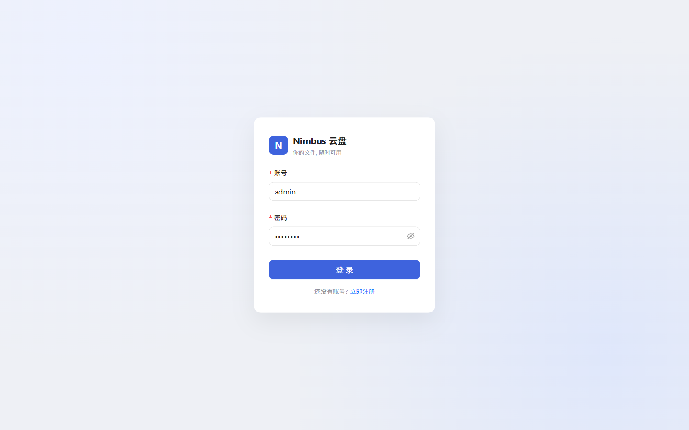
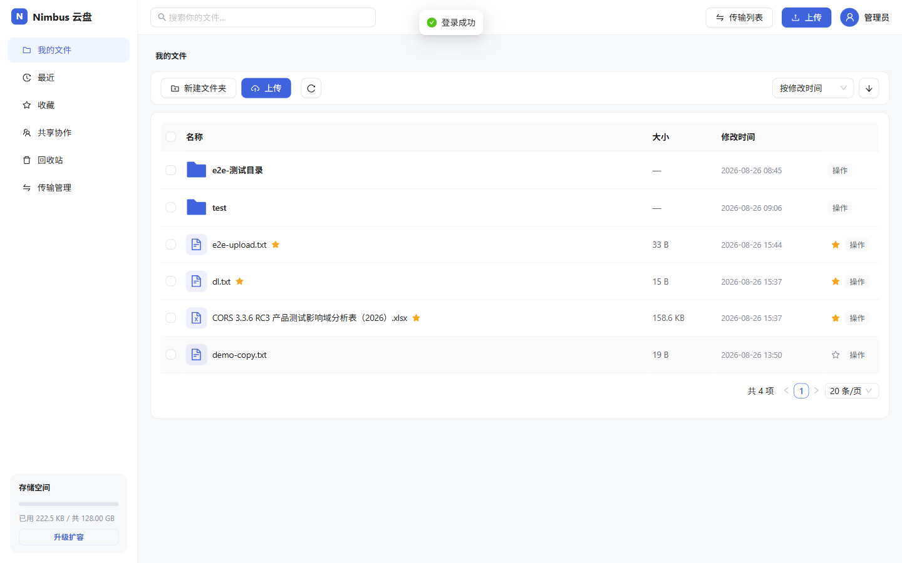
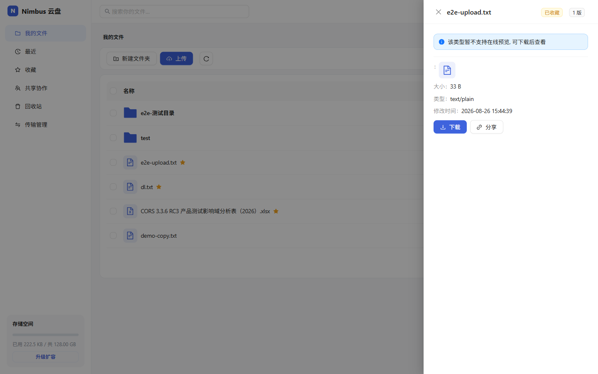
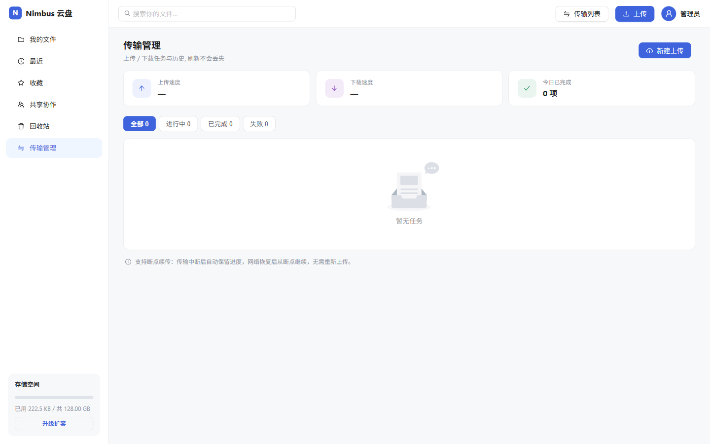
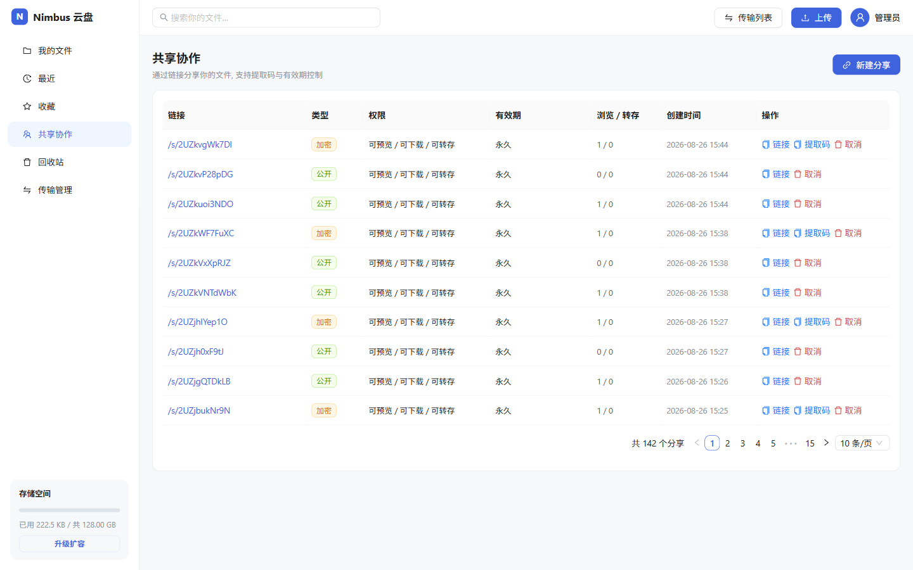
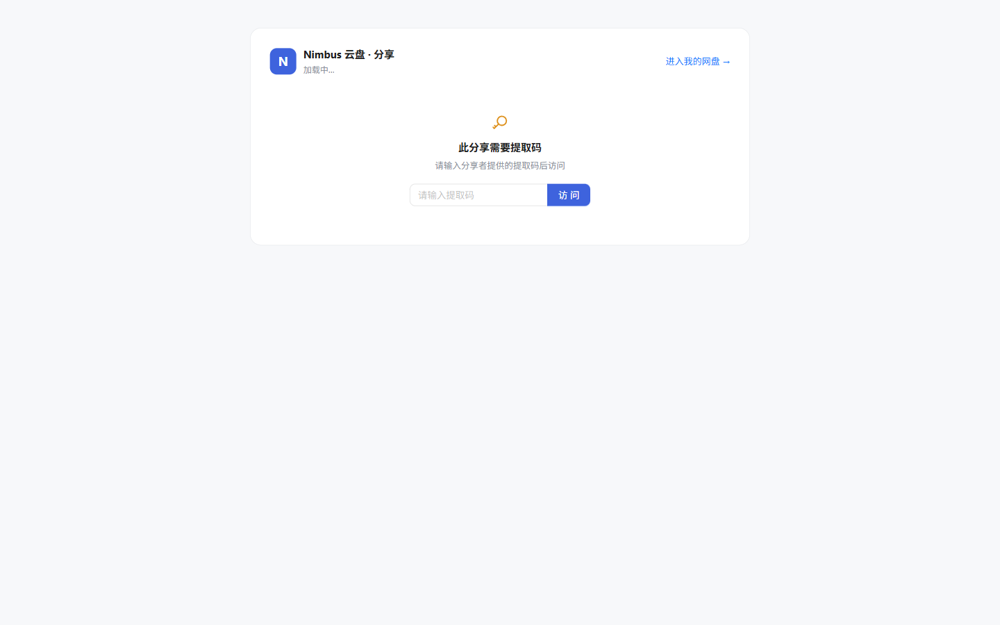
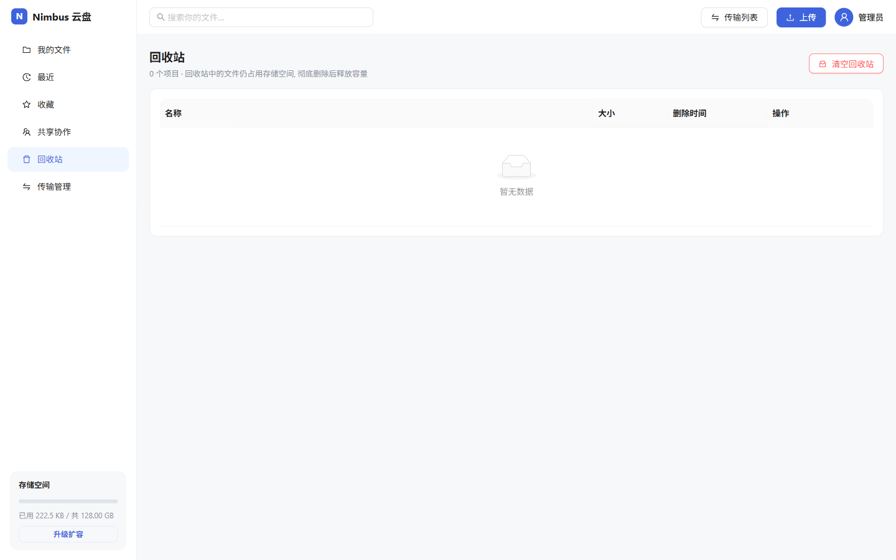
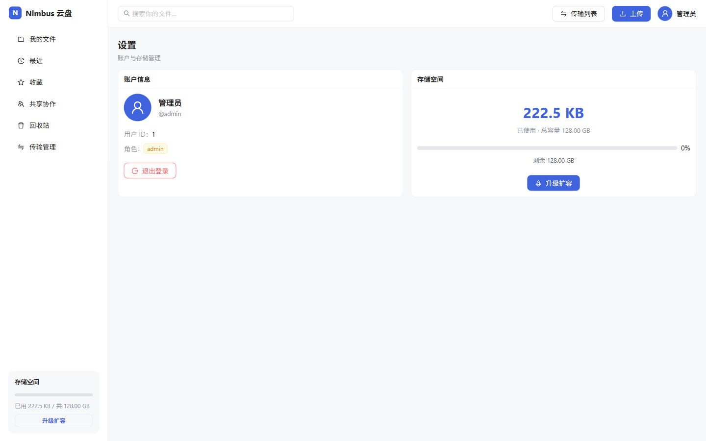

# Nimbus 云盘(nimbus-cloud)

企业级网盘系统,基于 **Spring Boot 3.5.5 + JDK 21 + React 18 + TypeScript** 的前后端分离架构。
后端参考 [hmoob-mini-backend](https://github.com/7VVI/hmoob-mini-backend)(RuoYi-Vue-Plus 风格)的组件化设计自研实现;
前端界面按产品原型(`docs/nimbus_cloud_prototype.html`)高度还原。

> 架构设计文档: `docs/design.md` · 产品原型: `docs/nimbus_cloud_prototype.html`

## 界面预览

| 登录 | 我的文件 |
|---|---|
|  |  |

| 文件预览(版本管理) | 传输管理(进度/网速/持久化) |
|---|---|
|  |  |

| 共享协作 | 分享访问页(免登录) |
|---|---|
|  |  |

| 回收站 | 设置 |
|---|---|
|  |  |

## 技术栈

### 后端

| 类别 | 选型 |
|---|---|
| 基础框架 | Spring Boot 3.5.5 / JDK 21 |
| ORM | MyBatis-Plus 3.5.12(公共字段填充 / 逻辑删除 / 分页) |
| 数据源 | Druid · MySQL 8 |
| 缓存 | Redisson + Spring Cache + RedisUtils 门面 |
| 认证鉴权 | Sa-Token(Redis 持久化)· `@SaCheckRole` 注解鉴权 |
| 对象存储 | 自研 StorageService 抽象: 本地磁盘 / S3 兼容存储(MinIO 等), 配置切换 |
| 操作审计 | `@OperLog` 注解切面 + 事件异步落库 |
| 接口文档 | SpringDoc OpenAPI |

### 前端(nimbus-web)

| 类别 | 选型 |
|---|---|
| 框架 | React 18 · TypeScript · Vite 5 |
| UI | Ant Design 5(主题贴合原型) |
| 路由/请求 | React Router 6 · Axios(统一 `/api` 前缀与 401 处理) |
| 上传 | 自研分片上传管理器(5MB 分片 · SHA-256 秒传 · 断点续传 · 网速) |
| 下载 | 自研下载管理器(进度/网速/取消/重试/完成通知+快速打开) |

## 功能清单

- **用户中心**:注册 / 登录 / 退出,注册即送 128GB 配额
- **文件管理**:上传(秒传 · 分片断点续传 · 新版本)· 下载(单文件 / 批量 zip 打包)· 重命名 · 移动(拖拽)· 复制 · 收藏 · 最近 · 排序
- **文件夹管理**:创建 / 重命名 / 移动(循环引用防护)· 目录树 · 面包屑(物化路径方案)
- **文件分享**:Base62 短链 · 提取码自动生成 · 链接自带提取码(粘贴即开)· 有效期 · 权限多选(预览/下载/转存可组合)· 免登录访问 · 一键转存
- **回收站**:软删除 · 恢复(原位置校验)· 彻底删除(无引用才删对象)· 清空
- **搜索**:文件名关键字 + 类型过滤 + 重置条件
- **预览**:按类型分类(图片 / 音视频 Range 流式 / 文本代码 / 文档),历史版本查看与回滚
- **传输管理**:上传/下载统一队列,进度 · 网速 · 剩余时间 · 暂停/继续/重试,记录持久化(刷新不丢)
- **配额**:上传前检查 · 用量实时增减(Redis 缓存)
- **审计日志**:`@OperLog` 自动采集,管理员查询

## 模块结构

```
nimbus-cloud
├── nimbus-common              通用基座: Result / 异常体系 / 分页 / 工具类
├── nimbus-framework           框架组件(独立 jar + 自动装配 + 开关)
│   ├── nimbus-json            Jackson 全局序列化(Long 转字符串 / 时间格式)
│   ├── nimbus-mybatis         MyBatis-Plus 装配 + BaseEntity
│   ├── nimbus-redisson        Redis / Spring Cache + RedisUtils
│   ├── nimbus-security        Sa-Token 认证 + LoginUser + 401/403 翻译
│   ├── nimbus-log             操作日志(@OperLog 切面 + 事件解耦)
│   ├── nimbus-opendoc         接口文档
│   └── nimbus-storage         对象存储(本地磁盘 / S3 兼容双实现)
├── nimbus-module              业务模块(由 server 统一装配)
│   ├── nimbus-system          用户 / 认证 / 配额 / 审计
│   └── nimbus-netdisk         网盘核心业务
├── nimbus-server              启动模块(配置 + 幂等建表脚本)
├── nimbus-web                 前端(React 18 + TS + Vite + AntD)
└── deploy                     docker-compose(MySQL + Redis)
```

## 快速开始

### 1. 基础设施(Docker)

```bash
docker compose -f deploy/docker-compose.yml up -d
```

### 2. 后端

默认连接 `127.0.0.1:3306/nimbus_cloud`(root/root),按需修改
`nimbus-server/src/main/resources/application.yaml`;启动时自动执行幂等建表/种子脚本。

```bash
mvn clean package -DskipTests
java -jar nimbus-server/target/nimbus-server.jar
```

内置账号:`admin / admin123`(管理员)、`nimbus / admin123`
接口文档:`http://127.0.0.1:8080/swagger-ui.html`

### 3. 前端

```bash
cd nimbus-web
npm install
npm run dev          # http://localhost:5173, /api 自动代理到 8080
npm run build        # 产物在 dist/
```

### 4. 验证

```bash
bash smoke-test.sh           # 后端 30 项端到端用例
cd nimbus-web && node scripts/e2e.mjs   # 浏览器 68 项端到端用例(需系统 Chrome)
```

## 存储切换

```yaml
nimbus:
  storage:
    type: local       # local 本地磁盘(默认) | oss 切换 S3 兼容存储(MinIO 等)
    local:
      base-path: ./data/nimbus-storage
    # oss:
    #   endpoint: 127.0.0.1:9000
    #   bucket-name: nimbus
    #   access-key: minioadmin
    #   secret-key: minioadmin
```

## 扩展指引

- **新增存储实现**:实现 `StorageService` 接口并在 `StorageAutoConfiguration` 注册,业务零改动
- **新增业务模块**:仿照 `nimbus-netdisk` 建模块,在父 POM 与 server 追加依赖
- **拆分微服务**:模块按 `docs/design.md` 规划可拆为独立服务,公共组件已在框架层就绪